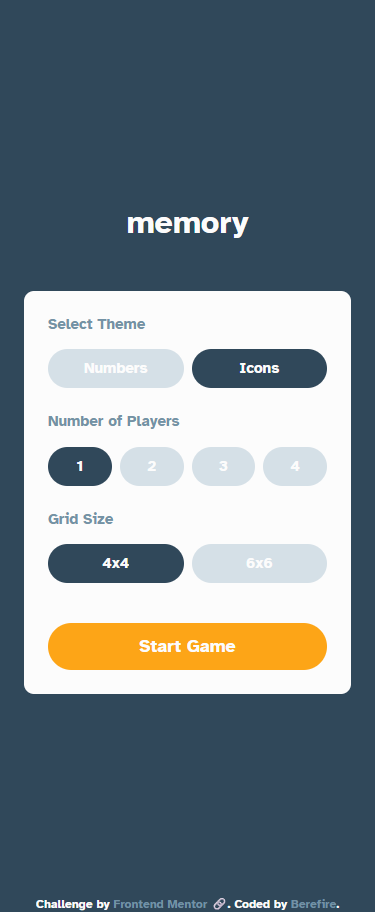
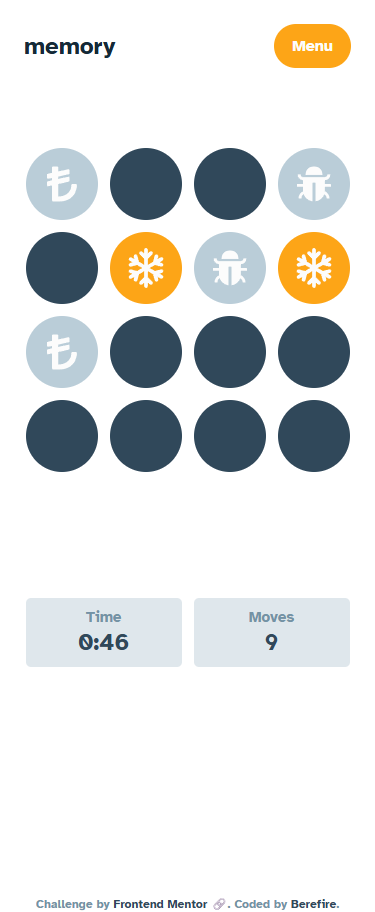
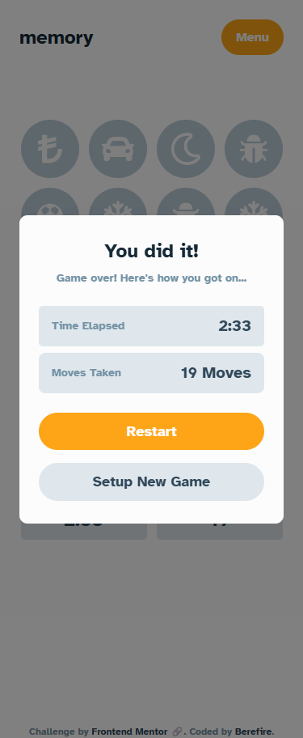
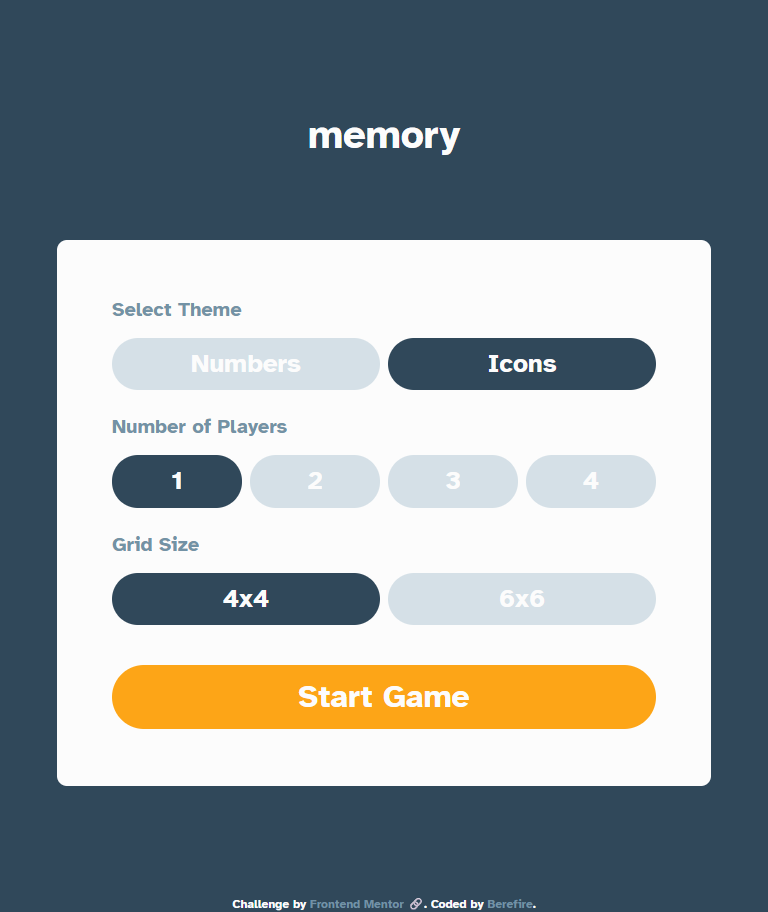
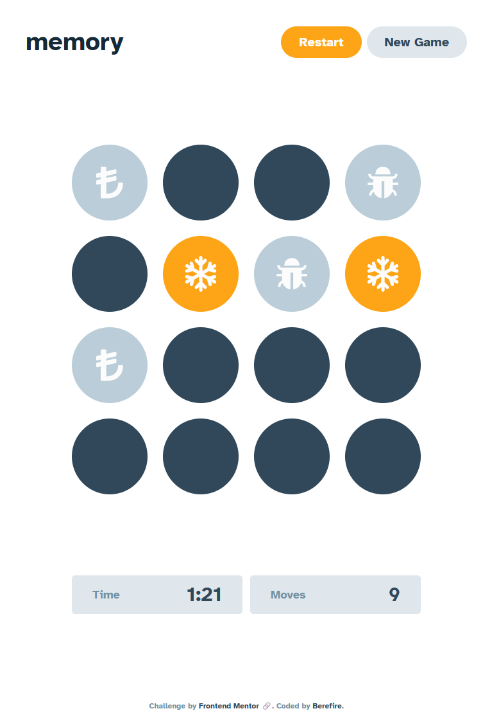
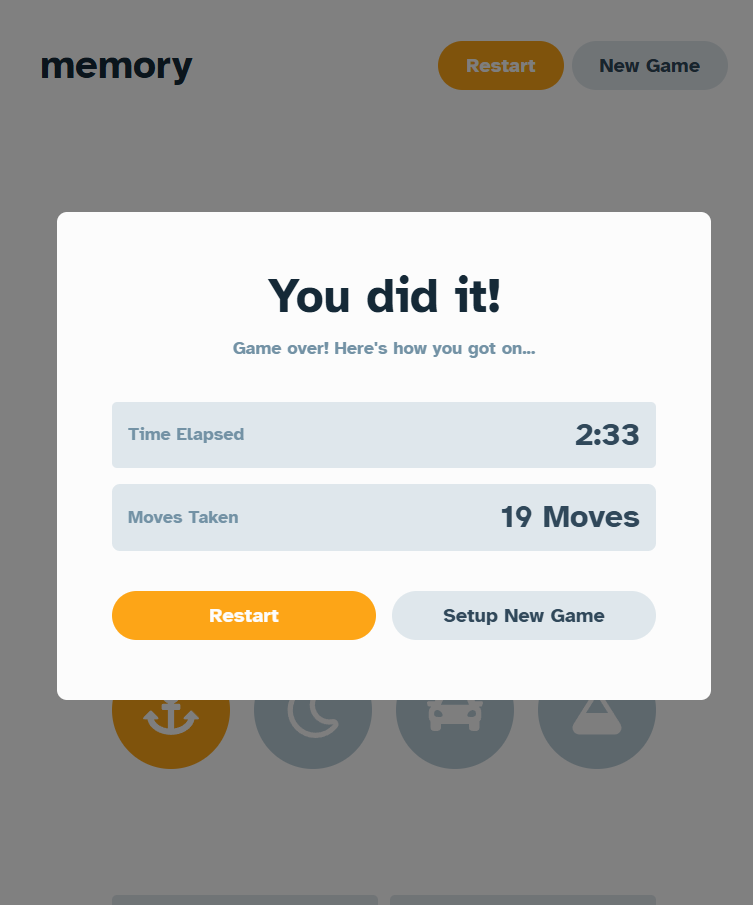
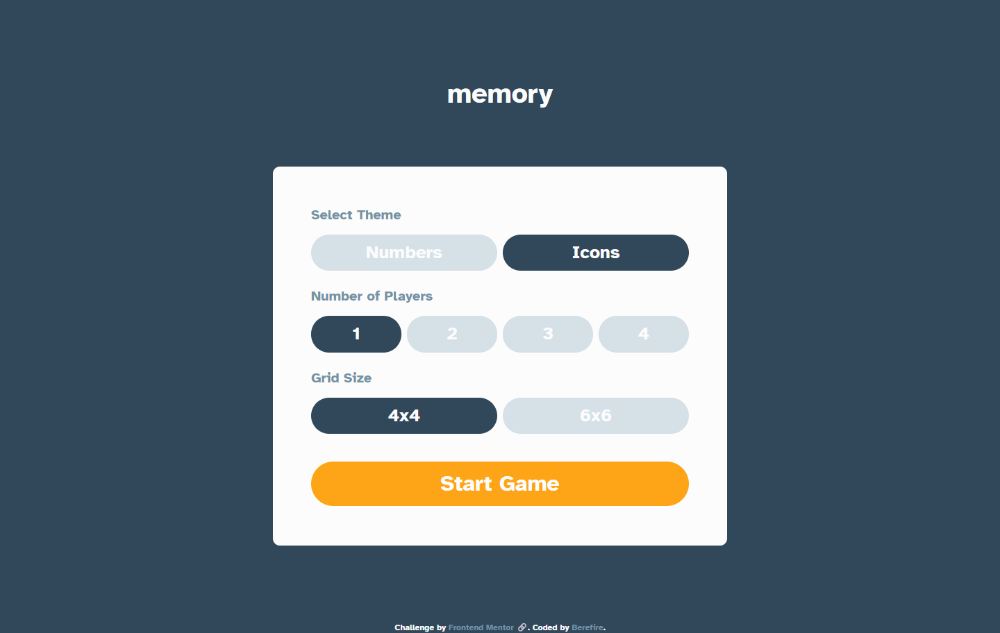
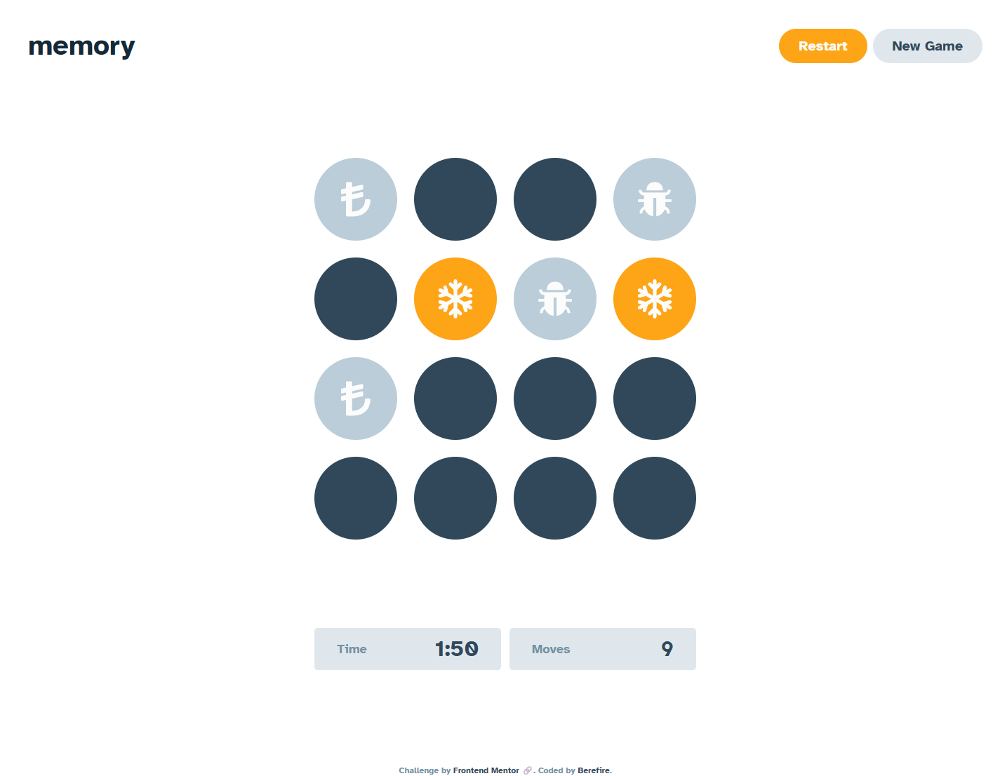
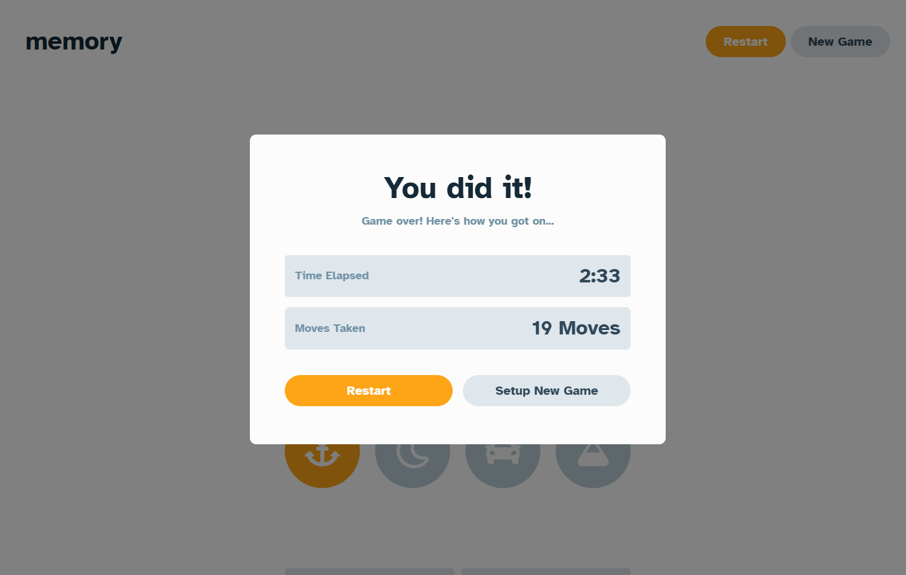

# Frontend Mentor - Memory game solution


[](https://www.frontendmentor.io/)


This is a solution to the [Memory game challenge on Frontend Mentor](https://www.frontendmentor.io/challenges/memory-game-vse4WFPvM). Frontend Mentor challenges help you improve your coding skills by building realistic projects. 

## Table of contents

- [Overview](#overview)
  - [The challenge](#the-challenge)
  - [Screenshot](#screenshot)
  - [Links](#links)
- [My process](#️my-process)
  - [Built with](#built-with)
  - [What I learned](#what-i-learned)
  - [Continued development](#continued-development)
  - [Useful resources](#useful-resources)
  - [AI Collaboration](#ai-collaboration)
- [Author](#author)
- [Acknowledgments](#acknowledgments)

## 📖Overview

### The challenge

Users should be able to:

- Choose a theme (numbers or icons), a grid size (4x4 or 6x6), and a number of players (1-4) before starting a game
- Flip cards to find matching pairs, with matched pairs staying face-up
- Play solo, tracking time elapsed and moves taken, or with up to 4 players, tracking whose turn it is and each player's score
- See a results screen at the end of the game, showing either the final time/moves (solo) or the ranked players and the winner or tie (multiplayer)
- Restart the current game or set up a new one from a menu, accessible at any point during play
- View the optimal layout for each page depending on their device's screen size

### 📸Screenshot

#### Mobile

| _Setup_ | _Gameplay_ | _Results_ |
| ------ | ------ | -------- |
|  |  |  |

#### Tablet

| _Setup_ | _Gameplay_ | _Results_ |
| ------ | ------ | -------- |
|  |  |  |

#### Desktop

| _Setup_ | _Gameplay_ | _Results_ |
| ------ | ------ | -------- |
|  |  |  |

---

### 🔗Links

- Solution URL: TODO - add your Frontend Mentor solution URL once submitted
- Live Site URL: [https://berefire.github.io/memory-game/](https://berefire.github.io/memory-game/)

---

## ⚙️My process

### Built with

- [React](https://react.dev/) - JS library for building the UI as small, composable components
- [Vite](https://vitejs.dev/) - build tool and dev server
- [Tailwind CSS v4](https://tailwindcss.com/) - utility-first styling, with a custom color palette (including a "grey" spelling to match Frontend Mentor's own style) and a custom `focus-ring` utility for accessible keyboard focus states
- [Storybook](https://storybook.js.org/) - for developing and testing components in isolation, using CSF3 stories and `fn()` mocks for dispatched actions
- `useReducer` - for all game state (setup settings, card deck, flipped/matched cards, players, moves, and time), with a single `dispatch` threaded down through every component
- The native `<dialog>` element - for both the in-game menu and the results screen, each with different dismissal rules (see below)
- `sessionStorage` - to persist game state across an accidental page refresh, using `useReducer`'s lazy-init argument
- Conventional Commits for commit message structure

---

### 💡What I learned

**A React component only ever receives one argument: a single props object.** Writing `function Attribution(colorText = "text-white", colorLink = "text-blue-950")` looked reasonable, but React always calls a component with one object, never two positional arguments - so `colorText` silently received the _*entire*_ props object, and `colorLink` was always `undefined`, permanently stuck at its default. The fix is destructuring the single object parameter:

```js
function Attribution({ colorText = "text-white", colorLink = "text-blue-950" }) {
```

**`flex-1`'s effect completely depends on its parent's `flex-direction` - the same class means something different in different contexts.** `StatsBar`'s own container had `flex-1` inside a `flex-col` page layout, meaning "grow to fill leftover _*vertical*_ space" - which made the stats row balloon downward and swallow the whole page's remaining height, instead of sitting at its natural size right below the game board. Removing that one class fixed it, while `flex-1` on `StatTile` (a child of `StatsBar`'s own _*row*_) was correct all along, since it meant "grow horizontally" there instead.

**Matching one flex item's width to an intrinsically-sized sibling doesn't need hardcoded pixel values.** The game board is a CSS grid with fixed-size columns, so its rendered width isn't `100%` of anything - it's determined by its own content. Wrapping the board and the stats row together in a `display: inline-flex; flex-direction: column` container makes that wrapper shrink-wrap to its widest child (the board), and giving the stats row `self-stretch` then matches it to that computed width automatically, without ever calculating the board's exact width by hand.

**`justify-content` only distributes space between flex items - it does nothing to their own width.** `justify-between` correctly spread the player tiles from one edge of the row to the other, but each tile still stayed at its own small, content-based width, leaving big gaps rather than evenly-sized tiles. Making the tiles actually equal-width needed a different tool entirely: `flex-1` on each tile's own flex-item root, so they grow to claim equal space instead of relying on `justify-content` to fill the gaps.

**A native `<dialog>`'s `cancel` event fires _*before*_ Escape actually closes it**, which is what makes an intentionally non-dismissible modal possible. The results screen needed to block both Escape and backdrop clicks (the player must choose Restart or Setup New Game), while the in-game menu needed to stay dismissible with both. The difference came down to one line:

```js
dialog.addEventListener("cancel", (e) => e.preventDefault());
```

present on the results modal and deliberately absent from the menu.

**`useReducer`'s third argument lets initial state be computed lazily, which is exactly what's needed to resume a game after a refresh.** Passing a function as `useReducer`'s third argument (`useReducer(reducer, initialState, loadState)`) means `loadState(initialState)` runs once on mount to compute the _*actual*_ starting state - reading from `sessionStorage` when something was saved, and falling back to `initialState` otherwise - without needing to restructure the reducer itself.

**Vite's default asset paths break on a GitHub Pages project site**, because Vite assumes the app is served from the domain root (`/`), while a project site like `berefire.github.io/memory-game/` actually serves everything from that subpath. Without `base: '/memory-game/'` set in `vite.config.js`, the built `index.html` references its JS bundle at the wrong path entirely, and the page loads blank with no visible error unless you check the console.

---

### 🚀Continued development

- **Keyboard grid navigation for the game board** - cards are individually focusable via Tab, but there's no arrow-key navigation between them, so reaching a card late in a 6x6 grid means tabbing through every card before it rather than moving spatially like a native grid widget would.
- **Automated tests for the reducer's game logic** - matching pairs, turn advancement, and win/tie detection currently have no test coverage; Storybook interaction tests (or React Testing Library) would catch regressions in this logic that visual review alone wouldn't.
- **Skip sessionStorage writes on the setup screen** - the app currently persists state on every change, including while still on the setup screen, where there's nothing meaningful yet to resume.

---

### 📚Useful resources

- [MDN - The Dialog element](https://developer.mozilla.org/en-US/docs/Web/HTML/Element/dialog) - Reference for `showModal()`/`close()` and the `cancel` event used to control Escape-key dismissal per-modal.
- [MDN - Window: sessionStorage property](https://developer.mozilla.org/en-US/docs/Web/API/Window/sessionStorage) - Confirmed the per-tab, clears-on-close semantics that made it the right fit over `localStorage` for resuming an in-progress game.
- [React docs - useReducer](https://react.dev/reference/react/useReducer) - Documented the lazy-initialization third argument used for the sessionStorage rehydration.
- [Tailwind CSS - Flexbox & Grid](https://tailwindcss.com/docs/flex) - Reference while debugging the `flex-1` direction-dependence and `justify-between` vs. equal-width tile issues.
- [Vite - Static Asset Handling / base](https://vitejs.dev/guide/assets.html) - Confirmed why `base` needs to be set explicitly for a GitHub Pages project site.

---

### 🤖AI Collaboration

I used Claude throughout this project as a pair-programming partner rather than having it write the project for me: I wrote and applied the code myself, and Claude explained concepts, reviewed my components for accessibility and correctness, and proposed code for me to review and apply when I asked directly.

- **What worked well:** pasting actual screenshots alongside my code was what actually solved the trickiest layout bug in this project - the stats row not matching the game board's width. The gap only became obvious once the rendered result and the code were compared side by side; from the code alone, the `flex-1` misconfiguration looked reasonable.
- **What didn't work as well at first:** that same layout bug took several rounds to fully resolve - a first fix corrected the container's overall width, a second fix was still needed to actually distribute that width evenly across the player tiles, since matching a container's width and giving its children equal widths turned out to be two separate problems.

---

## 👤Author

- Frontend Mentor - [@berefire](https://www.frontendmentor.io/profile/berefire)
- GitHub - [@berefire](https://github.com/berefire)

---

## 🙏Acknowledgments

Thanks to Frontend Mentor for the challenge brief, and to Claude for the pair-programming support and code reviews.

---
